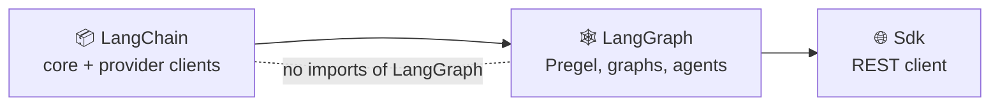

# 🐘🦜 langchain-php

  -orange)

A **faithful PHP port** of the [LangChain JS](https://github.com/langchain-ai/langchainjs) and
[LangGraph JS](https://github.com/langchain-ai/langgraphjs) SDKs.

This is not a thin wrapper and not a re-imagining. It is a direct port: the same
class hierarchies, the same algorithms, the same LCEL composition semantics, and
the same Pregel durable-execution engine — translated into idiomatic PHP and
verified by ported test suites.

> **Status:** active port. See [Port status](#port-status) for exactly what is
> covered and what is not. Nothing below is claimed beyond what the test suite proves.

---

## Why PHP?

LangChain's abstractions — a protocol-based `Runnable` interface, lazily
composed chains, streaming, and an actor-model graph runtime with durable
checkpointing — are language-agnostic. What has been missing is a port that
keeps the semantics exact instead of flattening them into a Laravel-ish helper.

This port takes the opposite stance: **fidelity first.** If TypeScript does it,
PHP does it, with the same names.

---

## Install

```bash
composer require shoemoney/langchain-php
```

Requires PHP 8.2+.

---

## Design notes

Three decisions make the port possible without a single `\Closure` soup.

### 1. Promises, resolved synchronously

TypeScript threads a `Promise` through every entry point. PHP has no
language-level async, but it does have **Fibers** (8.1+). `LangChain\Utils\Promise`
implements the real algebra — `then`, `catch`, `finally`, flattening — and
`Await::sync()` drives it. You write the shape you know:

```php
$result = $chain->invoke(['input' => 'hello'], $config);
```

and the internals stay promise-shaped so ported logic maps one-to-one.

### 2. Streaming is a `Generator`

`Runnable::stream()` returns a `\Generator` of `[channel, value]` tuples —
structurally identical to the `[channel, chunk]` tuples the JS
`EventSource`/`Observable` emits.

```php
foreach ($chain->stream($input) as $channel => $chunk) {
    echo $chunk;
}
```

### 3. Serialization is a real interface

`Serializable` provides `toJson()` / `lcNamespace()` / `lcId()` and is used by
the checkpointers, so serialized state is portable across processes exactly as
it is in JS.

---

## Quick start

```php
use LangChain\LanguageModels\Chat\OpenAI\ChatOpenAI;
use LangChain\Prompts\ChatPromptTemplate;

$prompt = ChatPromptTemplate::fromMessages([
    ['system', 'You are a helpful assistant.'],
    ['human', '{question}'],
]);

$model = new ChatOpenAI(['model' => 'gpt-4o-mini']);

$chain = $prompt->pipe($model);

$response = $chain->invoke(['question' => 'Why is the sky blue?']);
echo $response->content;
```

### 🦾 A ReAct agent (`createReactAgent`)

`ReactAgent::create(array $params)` takes the keys of upstream's `CreateReactAgentParams`
(`llm`, `tools`, `prompt`, `checkpointer`, `interruptBefore`, `version`, ...) and returns a
`CompiledStateGraph`. This runs offline against the scripted fake model:

```php
use LangChain\Messages\AIMessage;
use LangChain\Utils\Testing\FakeToolCallingChatModel;
use LangGraph\Prebuilt\ReactAgent;

$agent = ReactAgent::create([
    'llm' => new FakeToolCallingChatModel(['responses' => [new AIMessage('hi there')], 'sleep' => 0]),
    'tools' => [],
]);

$result = $agent->invoke(['messages' => 'hello']);
echo end($result['messages'])->content; // hi there
```

### ⚙️ The functional API (`entrypoint` / `task`)

A task call returns a settled `Promise`; `Await::sync()` unwraps it. Tasks run sequentially
and eagerly (see [non-exact behaviours](./PORT_STATUS.md)).

```php
use LangChain\Runnables\RunnableConfig;
use LangChain\Utils\Await;
use LangGraph\Checkpoint\MemorySaver;
use LangGraph\Func\Func;

$double = Func::task('double', fn (int $n): int => $n * 2);

$app = Func::entrypoint(
    ['name' => 'app', 'checkpointer' => new MemorySaver()],
    fn (array $nums): array => array_map(fn ($n) => Await::sync($double($n)), $nums),
);

$app->invoke([1, 2, 3], new RunnableConfig(configurable: ['thread_id' => 't1'])); // [2, 4, 6]
```

### 🔎 An in-memory vector store

`MemoryVectorStore` takes any `LangChain\Embeddings\Embeddings`; `OllamaEmbeddings` is the only
concrete one shipped. There are no other vector-store backends yet.

```php
use LangChain\VectorStores\MemoryVectorStore;

$store = MemoryVectorStore::fromTexts(['aaa', 'bbb', 'abab'], [[], [], []], $embeddings);
$docs  = $store->similaritySearch('aa', 2);
```

---

## Port status

Coverage is tracked per subsystem in [`PORT_STATUS.md`](./PORT_STATUS.md). The test
suite is the source of truth: every ported module ships with its converted tests, and
`composer test` must be green for a subsystem to be called complete. **The SDK port is not
complete**; the table summarises, `PORT_STATUS.md` has the evidence and the known
non-exact behaviours.

| Area | State | Notes |
|---|---|---|
| 🧱 Messages, runnables (LCEL), prompts, output parsers, tools, tracers | ✅ Ported | `streamEvents`/`streamLog` are partial |
| 💬 Chat models | 🟡 Partial | `ChatOpenAI` (Chat Completions and the Responses API, as a facade over `BaseChatOpenAI` / `ChatOpenAICompletions` / `ChatOpenAIResponses`), `ChatAnthropic`, `ChatOllama`. Streamed OpenAI custom-tool calls do not fold end to end; no Azure, no OpenAI hosted tools, no other providers |
| 📚 Retrieval | 🟡 Partial | Base layer only: `VectorStores` (`MemoryVectorStore`), `Retrievers`, `ExampleSelectors`, `Indexing` (`RecordManager`, `Index::index`), `DocumentLoaders`. `FewShot*` prompt templates are not ported; `OllamaEmbeddings` is the only concrete embeddings class; no concrete backends, retrievers or loaders |
| 🗄️ Stores, caches, chat history, memory, storage | ✅ Ported | `LangChain\{Stores,Caches,ChatHistory,Memory,Storage}`; models accept a `cache` option. `BaseMemory` only, no concrete memory classes |
| 🔥 Structured query, text splitters, embeddings seam | ✅ Ported | |
| 🕸️ Pregel engine, channels, `Graph`, `MessageGraph` | ✅ Ported | Superstep concurrency is sequential; timeouts cannot preempt; `sync` and `async` durability are identical |
| 🧭 `StateGraph` | 🟡 Parity with non-exact items | `addSequence`, input/output schemas, node policies, `errorHandler`, `setNodeDefaults`, `validate`. The handler runs inline, `timeout` is not enforced, `GraphCallbackHandler` events are not ported; drawing / `getGraph` is open |
| ⚙️ Functional API | 🟡 Partial | `Func::entrypoint`, `Func::task`, `Func::getPreviousState`; sequential, no `custom` stream mode |
| 🦾 Prebuilt | 🟡 Partial | `ToolNode`, `toolsCondition`, `ReactAgent::create`, `HumanInterrupt`. A known engine defect breaks resume for a v2 agent making exactly two tool calls (`Topic::fromCheckpoint`, see HANDOFF) |
| 🤖 Agents (`LangGraph\Agents`) | 🟡 Foundations only | State, errors, runtime, createAgent-flavoured `ToolNode`. **`createAgent` and middleware are not ported** |
| 💾 Checkpointers | 🟡 Partial | Memory, SQLite, Postgres (env-gated in CI), Redis (tested against a fake client), MongoDB (tested against a fake collection only, **never run against a real server**) |
| 🧠 LangGraph store and cache | ✅ Ported | In-memory store and cache |
| 🌐 LangGraph client SDK | 🟡 Partial | assistants, threads, store, crons, runs, `joinStream` and stream retry. `ThreadsClient::stream()` (the v2 protocol) is not ported; a signal is a polled callable, not an `AbortSignal` |
| 🖼️ UI bindings (`sdk-react` etc.) | ⛔ Out of scope | Browser-only |

<details>
<summary>🚫 Not ported yet</summary>

- `createAgent`, middleware, structured-response transformers
- Supervisor / Swarm, `RemoteGraph`
- Graph drawing (`getGraph`)
- Azure, OpenAI hosted tools, and every provider beyond OpenAI, Anthropic and Ollama
- Concrete vector-store backends, retrievers and document loaders
- `custom` / `checkpoints` / `tasks` stream modes

</details>

---

## 🏗️ Architecture

`src/LangGraph` builds on `src/LangChain`, never the other way round; a layering test enforces it.



```
src/
  LangChain/
    Caches/           BaseCache, InMemoryCache
    ChatHistory/      BaseChatMessageHistory, BaseListChatMessageHistory, InMemoryChatMessageHistory
    DocumentLoaders/  DocumentLoader, BaseDocumentLoader
    Embeddings/       Embeddings interface, OllamaEmbeddings
    ExampleSelectors/ Length-based and semantic-similarity selectors, prompt selectors
    Indexing/         RecordManager, InMemoryRecordManager, HashedDocument, Index
    LanguageModels/   BaseChatModel, BaseLLM, Outputs/
      Chat/          OpenAI/ (ChatOpenAI facade, Completions, Responses), Anthropic/, Ollama/
    Load/             Serializable
    Memory/           BaseMemory
    Messages/         BaseMessage + Human/AI/System/Tool/Function, content blocks
    OutputParsers/    String, JSON, structured, OpenAITools/
    Prompts/          Prompt templates, chat prompt templates
    Retrievers/       BaseRetriever, BaseDocumentCompressor
    Runnables/        Runnable, Sequence, Parallel, Branch, Lambda, Binding, Assign, Passthrough
    Schema/           Document, PromptValue
    Storage/          LocalFileStore, EncoderBackedStore, InMemoryStore
    Stores/           BaseStore, InMemoryStore
    StructuredQuery/  Query IR, visitors, translators
    TextSplitters/    Character, Recursive, Markdown, Latex, language tables
    Tools/            StructuredTool, DynamicTool, BaseToolkit, ToolRuntime
    Tracers/          Callback managers, tracers, event-stream and log-stream handlers
    Utils/            Promise, Await, Observable, env, JSON patch, AsyncCaller, ...
      Http/          HttpClient seam, Guzzle client, SSE parser
      Testing/       Fakes (incl. FakeToolCallingChatModel)
    VectorStores/     VectorStore, MemoryVectorStore, VectorStoreRetriever
  LangGraph/
    Agents/           createAgent foundations: AgentState, Runtime, Errors/, Nodes/ToolNode
    Cache/            BaseCache, InMemoryCache
    Channels/         BaseChannel, LastValue, BinaryOperatorAggregate, Topic, ...
    Checkpoint/       BaseCheckpointSaver, MemorySaver, SqliteSaver
      MongoDB/       MongoDBSaver over a MongoCollectionInterface seam
      Postgres/      PostgresSaver
      Redis/         RedisSaver, ShallowRedisSaver
      Serde/         JsonPlusSerializer
    Errors/           Interrupts, recursion and update errors
    Func/             Func::entrypoint, Func::task, Func::getPreviousState
    Graph/            Graph, CompiledGraph, Branch, MessageGraph, messages reducer
    Prebuilt/         ToolNode, toolsCondition, ReactAgent, AgentState, HumanInterrupt
    Pregel/           algo, loop, read, write, runner, retry, Call, CallScheduler, Validate, Timeout
      Checkpoint/    Engine-side saver contract
      Messages/      messages / tools stream handlers
    Sdk/              LangGraph API client (assistants, threads, store, crons, runs)
      Utils/         StreamRetry, Reconnect, Signals, SseDecoder
    State/            Annotation, StateGraph, CompiledStateGraph
    Store/            BaseStore, InMemoryStore
    Utils/            Hash, helpers
```

---

## Development

```bash
composer install
composer test                 # full suite
composer test -- --testsuite unit
composer coverage
```

The port is verified by *converted* tests — assertions, fixtures, and edge cases
are carried over from the TypeScript suites, including the property tests and
the Python-parity conformance tests from `langgraphjs`.

---

## License

MIT

---

<p align="center">Made with 🐘, a lot of ☕, and a refusal to call it done before the tests say so.</p>
