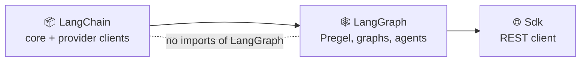

# 🐘🦜 langchain-php

  -orange)

A **faithful PHP port** of the [LangChain JS](https://github.com/langchain-ai/langchainjs) and
[LangGraph JS](https://github.com/langchain-ai/langgraphjs) SDKs.

This is not a thin wrapper and not a re-imagining. It is a direct port: the same
class hierarchies, the same algorithms, the same LCEL composition semantics, and
the same Pregel durable-execution engine — translated into idiomatic PHP and
verified by ported test suites.

> **Status:** active port. See [Port status](#port-status) for exactly what is
> covered and what is not. Nothing below is claimed beyond what the test suite proves.

---

## Why PHP?

LangChain's abstractions — a protocol-based `Runnable` interface, lazily
composed chains, streaming, and an actor-model graph runtime with durable
checkpointing — are language-agnostic. What has been missing is a port that
keeps the semantics exact instead of flattening them into a Laravel-ish helper.

This port takes the opposite stance: **fidelity first.** If TypeScript does it,
PHP does it, with the same names.

---

## Install

```bash
composer require shoemoney/langchain-php
```

Requires PHP 8.2+.

---

## Design notes

Three decisions make the port possible without a single `\Closure` soup.

### 1. Promises, resolved synchronously

TypeScript threads a `Promise` through every entry point. PHP has no
language-level async, but it does have **Fibers** (8.1+). `LangChain\Utils\Promise`
implements the real algebra — `then`, `catch`, `finally`, flattening — and
`Await::sync()` drives it. You write the shape you know:

```php
$result = $chain->invoke(['input' => 'hello'], $config);
```

and the internals stay promise-shaped so ported logic maps one-to-one.

### 2. Streaming is a `Generator`

`Runnable::stream()` returns a `\Generator` of `[channel, value]` tuples —
structurally identical to the `[channel, chunk]` tuples the JS
`EventSource`/`Observable` emits.

```php
foreach ($chain->stream($input) as $channel => $chunk) {
    echo $chunk;
}
```

### 3. Serialization is a real interface

`Serializable` provides `toJson()` / `lcNamespace()` / `lcId()` and is used by
the checkpointers, so serialized state is portable across processes exactly as
it is in JS.

---

## Quick start

```php
use LangChain\LanguageModels\Chat\OpenAI\ChatOpenAI;
use LangChain\Prompts\ChatPromptTemplate;

$prompt = ChatPromptTemplate::fromMessages([
    ['system', 'You are a helpful assistant.'],
    ['human', '{question}'],
]);

$model = new ChatOpenAI(['model' => 'gpt-4o-mini']);

$chain = $prompt->pipe($model);

$response = $chain->invoke(['question' => 'Why is the sky blue?']);
echo $response->content;
```

### 🧰 An agent with a tool and middleware (`createAgent`)

`Agent::create(array $options)` is the port of `createAgent`; it returns a `ReactAgent`. This runs
offline against the scripted fake model, which first asks for the `get_weather` tool and then answers:

```php
use LangChain\Messages\AIMessage;
use LangChain\Tools\Schema;
use LangChain\Utils\Testing\FakeToolCallingChatModel;
use LangGraph\Agents\Agent;
use LangGraph\Agents\Middleware;

use function LangChain\Tools\tool;

$weather = tool(
    fn (array $input): string => "It is sunny in {$input['city']}.",
    ['name' => 'get_weather', 'description' => 'Look up the weather', 'schema' => Schema::object(['city' => ['type' => 'string']], ['city'])],
);

$model = new FakeToolCallingChatModel([
    'sleep' => 0,
    'responses' => [
        new AIMessage(['content' => '', 'tool_calls' => [['type' => 'tool_call', 'name' => 'get_weather', 'args' => ['city' => 'Tokyo'], 'id' => 'call_1']]]),
        new AIMessage('Sunny in Tokyo.'),
    ],
]);

$agent = Agent::create([
    'model' => $model,
    'tools' => [$weather],
    'systemPrompt' => 'You are a weather bot.',
    'middleware' => [Middleware::create(['name' => 'log', 'beforeModel' => function (array $state): void { echo "model turn\n"; }])],
]);

$result = $agent->invoke(['messages' => 'Weather in Tokyo?']);
foreach ($result['messages'] as $m) {
    echo (new ReflectionClass($m))->getShortName(), ': ', $m->content, "\n";
}
// model turn
// model turn
// HumanMessage: Weather in Tokyo?
// AIMessage:
// ToolMessage: It is sunny in Tokyo.
// AIMessage: Sunny in Tokyo.
```

Pre-built middleware (call limits, retries, PII redaction, human-in-the-loop, summarisation and friends)
ships too, and is partial: see the next example and the table below.

### 🛡️ Pre-built middleware (PII redaction and a call limit)

Each pre-built middleware is a static `create()` that returns the same array `Middleware::create` does,
so it drops straight into the `middleware` list. This runs offline; the email never reaches the model:

```php
use LangChain\Messages\AIMessage;
use LangChain\Utils\Testing\FakeToolCallingChatModel;
use LangGraph\Agents\Agent;
use LangGraph\Agents\Middleware\ModelCallLimitMiddleware;
use LangGraph\Agents\Middleware\PiiMiddleware;

$agent = Agent::create([
    'model' => new FakeToolCallingChatModel(['sleep' => 0, 'responses' => [new AIMessage('Got it.')]]),
    'tools' => [],
    'middleware' => [
        PiiMiddleware::create('email', ['strategy' => 'redact']),
        ModelCallLimitMiddleware::create(['runLimit' => 3]),
    ],
]);

$result = $agent->invoke(['messages' => 'Mail me at jane@example.com']);
foreach ($result['messages'] as $m) {
    echo (new ReflectionClass($m))->getShortName(), ': ', $m->content, "\n";
}
// HumanMessage: Mail me at [REDACTED_EMAIL]
// AIMessage: Got it.
```

### 🌊 Streaming an agent run (`streamEvents` v3)

`ReactAgent::streamEvents($state, $config, 'v3')` returns a run stream: `messages()` yields one stream per AI message,
`output()` drives the run to its final state. The run is pull-driven, so a result settles only once you read it. This
runs offline against the scripted fake model:

```php
use LangChain\Messages\AIMessage;
use LangChain\Utils\Testing\FakeToolCallingChatModel;
use LangGraph\Agents\Agent;

$agent = Agent::create([
    'model' => new FakeToolCallingChatModel(['sleep' => 0, 'responses' => [new AIMessage('Hello from the stream.')]]),
    'tools' => [],
]);

$run = $agent->streamEvents(['messages' => 'hi'], null, 'v3');
foreach ($run->messages() as $message) {
    echo $message->content, "\n"; // Hello from the stream.
}
echo count($run->output()['messages']), " messages\n"; // 2 messages
```

### 🧭 `initChatModel`

`InitChatModel::init('provider:model', $fields)` returns a `ConfigurableModel` that builds the real client
lazily; `Agent::create` resolves `'model' => 'provider:model'` strings through it. Only the providers this port
ships are registered (`openai`, `anthropic`, `azure_openai`, `langsmith`, `ollama`, `deepseek`, `xai`, `fireworks`,
`together`); anything else is refused. This builds a client without making a request:

```php
use LangChain\LanguageModels\Chat\Universal\InitChatModel;

$model = InitChatModel::init('anthropic:claude-sonnet-4-5', ['apiKey' => 'sk-offline-demo']);
echo get_class($model), "\n"; // LangChain\LanguageModels\Chat\Universal\ConfigurableModel
var_dump($model->getModelInstance() instanceof \LangChain\LanguageModels\Chat\Anthropic\ChatAnthropic); // bool(true)
```

### 🦾 A ReAct agent (`createReactAgent`)

`ReactAgent::create(array $params)` takes the keys of upstream's `CreateReactAgentParams`
(`llm`, `tools`, `prompt`, `checkpointer`, `interruptBefore`, `version`, ...) and returns a
`CompiledStateGraph`. This runs offline against the scripted fake model:

```php
use LangChain\Messages\AIMessage;
use LangChain\Utils\Testing\FakeToolCallingChatModel;
use LangGraph\Prebuilt\ReactAgent;

$agent = ReactAgent::create([
    'llm' => new FakeToolCallingChatModel(['responses' => [new AIMessage('hi there')], 'sleep' => 0]),
    'tools' => [],
]);

$result = $agent->invoke(['messages' => 'hello']);
echo end($result['messages'])->content; // hi there
```

### ⚙️ The functional API (`entrypoint` / `task`)

A task call returns a settled `Promise`; `Await::sync()` unwraps it. Tasks run sequentially
and eagerly (see [non-exact behaviours](./PORT_STATUS.md)).

```php
use LangChain\Runnables\RunnableConfig;
use LangChain\Utils\Await;
use LangGraph\Checkpoint\MemorySaver;
use LangGraph\Func\Func;

$double = Func::task('double', fn (int $n): int => $n * 2);

$app = Func::entrypoint(
    ['name' => 'app', 'checkpointer' => new MemorySaver()],
    fn (array $nums): array => array_map(fn ($n) => Await::sync($double($n)), $nums),
);

$app->invoke([1, 2, 3], new RunnableConfig(configurable: ['thread_id' => 't1'])); // [2, 4, 6]
```

### 🔎 An in-memory vector store

`MemoryVectorStore` takes any `LangChain\Embeddings\Embeddings` (`OpenAIEmbeddings`,
`AzureOpenAIEmbeddings`, `FireworksEmbeddings`, `TogetherAIEmbeddings` and `OllamaEmbeddings` ship).
There are no other vector-store backends yet (the Postgres, Redis and MongoDB *stores* below are
key-value stores for LangGraph, not `VectorStore` backends).

```php
use LangChain\VectorStores\MemoryVectorStore;

$store = MemoryVectorStore::fromTexts(['aaa', 'bbb', 'abab'], [[], [], []], $embeddings);
$docs  = $store->similaritySearch('aa', 2);
```

---

## Port status

Coverage is tracked per subsystem in [`PORT_STATUS.md`](./PORT_STATUS.md). The test
suite is the source of truth: every ported module ships with its converted tests, and
`composer test` must be green for a subsystem to be called complete. **The SDK port is not
complete**; the table summarises, `PORT_STATUS.md` has the evidence and the known
non-exact behaviours.

| Area | State | Notes |
|---|---|---|
| 🧱 Messages, runnables (LCEL), prompts, output parsers, tools, tracers | ✅ Ported | `streamEvents`/`streamLog` are partial |
| 💬 Chat models | 🟡 Partial | `ChatOpenAI` (Chat Completions and the Responses API, as a facade over `BaseChatOpenAI` / `ChatOpenAICompletions` / `ChatOpenAIResponses`), Azure OpenAI (`AzureChatOpenAI`), `ChatAnthropic`, `ChatOllama`, `ChatFireworks`, `ChatTogetherAI`, `ChatDeepSeek`, `ChatXAI` (Chat Completions), `ChatXAIResponses` (the xAI Responses API; built-in tools only) and `ChatOpenRouter`. Every client is tested against a fake transport, never a live API. Streamed OpenAI custom-tool calls do not fold end to end; OpenRouter structured output is not validated |
| 🧩 Hosted tools | ✅ Ported (builders only) | OpenAI (`Chat\OpenAI\Tools`: web search, file search, code interpreter, MCP, image generation, shell, apply patch, computer use, custom, `DallEAPIWrapper`), Anthropic (`Chat\Anthropic\Tools`, with server-tool passthrough) and xAI search tools. Unit-tested against fakes; no live calls |
| 🧬 Embeddings and legacy LLMs | 🟡 Partial | `OpenAIEmbeddings`, `AzureOpenAIEmbeddings`, `FireworksEmbeddings`, `TogetherAIEmbeddings`, `OllamaEmbeddings`; legacy `LLMs\{OpenAI,AzureOpenAI,Fireworks,TogetherAI}`. Upstream's `Promise.all` concurrency runs sequentially here |
| 📚 Retrieval | 🟡 Partial | Base layer only: `VectorStores` (`MemoryVectorStore`), `Retrievers`, `ExampleSelectors`, `Indexing` (`RecordManager`, `Index::index`), `DocumentLoaders`. `FewShot*` prompt templates are not ported; no concrete backends, retrievers or loaders |
| 🗄️ Stores, caches, chat history, memory, storage | ✅ Ported | `LangChain\{Stores,Caches,ChatHistory,Memory,Storage}`; models accept a `cache` option. `BaseMemory` only, no concrete memory classes |
| 🔥 Structured query, text splitters, embeddings seam | ✅ Ported | |
| 🕸️ Pregel engine, channels, `Graph`, `MessageGraph` | ✅ Ported | Superstep concurrency is sequential; timeouts cannot preempt; `sync` and `async` durability are identical |
| 🧭 `StateGraph` | 🟡 Parity with non-exact items | `addSequence`, input/output schemas, node policies, `errorHandler`, `setNodeDefaults`, `validate`. The handler runs inline, `timeout` is not enforced, `GraphCallbackHandler` events are not ported |
| 🎨 Graph drawing | 🟡 Mermaid text ported | `Runnable::getGraph`, `Pregel::getGraph($config, $xray)` and `drawMermaid()` (checked byte for byte against upstream under Node). `drawMermaidPng()` returns image bytes but has never been run against the real mermaid.ink |
| ⚙️ Functional API | 🟡 Partial | `Func::entrypoint`, `Func::task`, `Func::getPreviousState`, `Pregel::getState` on an entrypoint and `Pregel::clearCache`; sequential, no `custom` stream mode |
| 🦾 Prebuilt | 🟡 Partial | `ToolNode` (unwraps `[Command, artifact]` tuples), `toolsCondition`, `ReactAgent::create`, `HumanInterrupt`, `Supervisor::create`, `Swarm::create`. The `Topic::fromCheckpoint` two-tool-call resume defect is fixed, and the engine now handles `ParentCommand` natively. Supervisor and Swarm have no remote-graph branch |
| 🤖 Agents (`LangGraph\Agents`) | 🟡 Partial | `Agent::create` (`createAgent`) returning a `ReactAgent`, `Middleware::create` with the hook nodes, `AgentNode`, `ToolStrategy` / `ProviderStrategy` structured responses, and the tool-call / subagent transformers, wired into `ReactAgent::streamEvents(..., 'v3')`. Nested agents do not surface on a real v3 run, because the engine emits no `tasks` chunks |
| 🛡️ Pre-built middleware | 🟡 Partial | Call limits, model and tool retries, model fallback, tool errors, dynamic system prompt, human-in-the-loop, summarisation, context editing, PII (and PII redaction), todo list, LLM tool selector, tool emulator, provider tool search, Anthropic prompt caching and OpenAI moderation. Still partial (see `PORT_STATUS.md`): Zod validation is hand-written, live `.int` suites are not ported, and the backoff tests keep upstream's wall-clock bounds. `ContextOverflowError` exists, bound `cache_control` reaches the Anthropic request body, and string models resolve through `initChatModel` |
| 🧭 `initChatModel` | 🟡 Partial | `InitChatModel::init` / `ConfigurableModel` over the nine providers the port ships; unported providers are refused. The cache key covers the whole call config. Tested over a fake transport only |
| 💾 Checkpointers | 🟡 Partial | Memory, SQLite, Postgres (env-gated in CI), Redis (tested against a fake client), MongoDB (tested against a fake collection only, **never run against a real server**) |
| 🧠 LangGraph store and cache | ✅ Ported | In-memory store and cache |
| 🗃️ LangGraph store backends | 🟡 Partial | `PostgresStore` (PDO, pgvector, TTL; its integration spec is env-gated and ran against a local server), `RedisStore` (fake-backed plus an env-gated live spec; `fromCluster` dropped) and `MongoDBStore` (over a collection seam and a fake, **never run against a real MongoDB or Atlas**; no `fromConnString` / client ownership) |
| 🔌 MCP adapters and client | 🟡 Partial | `LangGraph\Mcp\*` converts MCP tools, content, hooks and elicitation; `Mcp\Client` is an in-house client over **stdio and streamable HTTP**, and `MultiServerMcpClient` manages several servers. Tested against in-repo fixture servers only, never a third-party server. OAuth, SSE, resource templates and subscriptions are not ported (SSE and provider auth are refused with an error, not ignored) |
| 🌊 Run stream (v3) | 🟡 Partial | `LangGraph\Stream` (`RunStream`, `Mux`, `StreamChannel`, `Deferred`, messages / values / lifecycle / subgraph transformers). Pull-driven and sequential rather than async; `ThreadsClient::stream()` and the `RemoteGraphRunStream` projections are not ported |
| 🌐 LangGraph client SDK | 🟡 Partial | assistants, threads, store, crons, runs, `joinStream` and stream retry. `ThreadsClient::stream()` (the v2 protocol) is not ported; a signal is a polled callable, not an `AbortSignal` |
| 🛰️ `RemoteGraph` | 🟡 Partial | `RemoteGraph` and `RemoteRunStream` over the SDK client, using `runs->create` + `joinStream` because `ThreadsClient::stream()` is not ported. Only part of `RemoteGraphRunStream` is ported; server error events throw `RemoteException` |
| 🖼️ UI bindings (`sdk-react` etc.) | ⛔ Out of scope | Browser-only |

<details>
<summary>🚫 Not ported yet</summary>

- MCP OAuth, the SSE transport, resource templates and subscriptions (the client covers stdio and streamable HTTP only)
- `initChatModel` for providers the port has no client for (cohere, google, bedrock, groq, mistral, perplexity)
- `ThreadsClient::stream()` (v2) and the `RemoteGraph` v3 projections (about 13k upstream LOC, browser-shaped)
- `MongoDBStore.fromConnString` / `ownsClient` and `RedisStore.fromCluster`
- Providers beyond OpenAI (incl. Azure), Anthropic, Ollama, Fireworks, Together, DeepSeek, xAI and OpenRouter
- Concrete vector-store backends, retrievers and document loaders
- A production MongoDB driver adapter (the MongoDB saver and store have only run against fakes)
- `custom` / `checkpoints` / `tasks` stream modes

</details>

---

## 🏗️ Architecture

`src/LangGraph` builds on `src/LangChain`, never the other way round; a layering test enforces it.



```
src/
  LangChain/
    Caches/           BaseCache, InMemoryCache
    ChatHistory/      BaseChatMessageHistory, BaseListChatMessageHistory, InMemoryChatMessageHistory
    DocumentLoaders/  DocumentLoader, BaseDocumentLoader
    Embeddings/       Embeddings interface; OpenAI, AzureOpenAI, Fireworks, TogetherAI, Ollama embeddings
    Errors/           ContextOverflowError (non-retryable)
    ExampleSelectors/ Length-based and semantic-similarity selectors, prompt selectors
    Indexing/         RecordManager, InMemoryRecordManager, HashedDocument, Index
    LanguageModels/   BaseChatModel, BaseLLM, Outputs/
      Chat/          one directory per provider client:
        Universal/   InitChatModel, ConfigurableModel, ModelProviders (initChatModel)
        OpenAI/      ChatOpenAI facade, Completions, Responses, Converters/, Utils/
          Azure/     AzureChatOpenAI and its Completions / Responses variants
          Tools/     hosted-tool builders (web search, shell, computer use, ...)
        Anthropic/   ChatAnthropic, Profiles, Utils/
          Tools/     hosted-tool builders (web search, bash, text editor, ...)
        Ollama/      ChatOllama (NDJSON)
        Fireworks/   ChatFireworks
        TogetherAI/  ChatTogetherAI
        DeepSeek/    ChatDeepSeek (reasoning blocks)
        XAI/         ChatXAI (Completions), ChatXAIResponses, LiveSearch, Tools/
        OpenRouter/  ChatOpenRouter, Converters/, Utils/
      LLMs/          legacy completion LLMs: OpenAI, AzureOpenAI, Fireworks, TogetherAI
    Load/             Serializable
    Memory/           BaseMemory
    Messages/         BaseMessage + Human/AI/System/Tool/Function, content blocks
    OutputParsers/    String, JSON, structured, OpenAITools/
    Prompts/          Prompt templates, chat prompt templates
    Retrievers/       BaseRetriever, BaseDocumentCompressor
    Runnables/        Runnable, Sequence, Parallel, Branch, Lambda, Binding, Assign, Passthrough
      Graph/         Graph, Node, Edge, Mermaid (getGraph / drawMermaid)
    Schema/           Document, PromptValue
    Storage/          LocalFileStore, EncoderBackedStore, InMemoryStore
    Stores/           BaseStore, InMemoryStore
    StructuredQuery/  Query IR, visitors, translators
    TextSplitters/    Character, Recursive, Markdown, Latex, language tables
    Tools/            StructuredTool, DynamicTool, BaseToolkit, ToolRuntime
    Tracers/          Callback managers, tracers, event-stream and log-stream handlers
    Utils/            Promise, Await, Observable, env, JSON patch, AsyncCaller, ...
      Http/          HttpClient seam, Guzzle client, SSE parser
      Testing/       Fakes (incl. FakeToolCallingChatModel)
    VectorStores/     VectorStore, MemoryVectorStore, VectorStoreRetriever
  LangGraph/
    Agents/           Agent::create (createAgent), ReactAgent, Middleware::create, AgentState, Runtime, Errors/
      Middleware/    middleware types and utils, plus the pre-built sets (limits, retries, HITL,
                     summarization, PII, todo list, tool selector, emulator, ...); Provider/{Anthropic,OpenAI}/
      Nodes/         AgentNode, Before/After agent and model nodes, ToolNode
      Responses/     ToolStrategy, ProviderStrategy, ResponseFormats
      Transformers/  AgentRunStream, ToolCallTransformer, SubagentTransformer and protocol value classes
    Cache/            BaseCache, InMemoryCache
    Channels/         BaseChannel, LastValue, BinaryOperatorAggregate, Topic, ...
    Checkpoint/       BaseCheckpointSaver, MemorySaver, SqliteSaver
      MongoDB/       MongoDBSaver over a MongoCollectionInterface seam
      Postgres/      PostgresSaver
      Redis/         RedisSaver, ShallowRedisSaver
      Serde/         JsonPlusSerializer
    Errors/           Interrupts, recursion, update and ParentCommand errors, RemoteException
    Func/             Func::entrypoint, Func::task, Func::getPreviousState
    Graph/            Graph, CompiledGraph, Branch, MessageGraph, messages reducer
    Prebuilt/         ToolNode, toolsCondition, ReactAgent, AgentState, HumanInterrupt
      Supervisor/    Supervisor::create, handoff tools
      Swarm/         Swarm::create, handoff tools, active-agent router
    Pregel/           algo, loop, read, write, runner, retry, Call, CallScheduler, Validate, Timeout, RemoteGraph
      Checkpoint/    Engine-side saver contract
      Messages/      messages / tools stream handlers
    Mcp/              MCP tool / content / hook / elicitation conversion over McpClientInterface, MultiServerMcpClient
      Client/        McpClient, JsonRpc; Transport/ (stdio, streamable HTTP, SSE event parser)
      Connection/    ConnectionManager, ConnectionConfig, ManagedClient
    Stream/           v3 run stream: RunStream, Mux, StreamChannel, Deferred; Transformers/ (messages, values, lifecycle, subgraphs)
    Sdk/              LangGraph API client (assistants, threads, store, crons, runs)
      Utils/         StreamRetry, Reconnect, Signals, SseDecoder
    State/            Annotation, StateGraph, CompiledStateGraph
    Store/            BaseStore, InMemoryStore
      Postgres/      PostgresStore
      Redis/         RedisStore
      MongoDB/       MongoDBStore over a collection seam
    Utils/            Hash, helpers
```

---

## Development

```bash
composer install
composer test                 # full suite
composer test -- --testsuite unit
composer coverage
```

The port is verified by *converted* tests — assertions, fixtures, and edge cases
are carried over from the TypeScript suites, including the property tests and
the Python-parity conformance tests from `langgraphjs`.

---

## License

MIT

---

<p align="center">Made with 🐘, a lot of ☕, and a refusal to call it done before the tests say so.</p>
